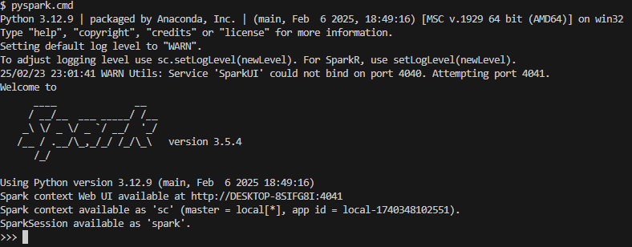

# upec_bigdata
Cours pour l'introduction au Big Data

# Spark installation for Windows 

Following this Medium article - [Spark Installation for Windows](https://medium.com/@dhirajmishra57/installing-spark-3-5-on-windows-e9bd183f84b9) for the installation, otherwise, following those steps below. 

The installation has been done with the following versions: 
- Windows 10
- Python 3.12.9
- Spark 3.5.4
- Hadoop 3.3.6
- Python dependencies: 
  - pyspark 3.5.3
  - pandas 2.2.3
  - numpy 1.26.4


## Introduction 
Apache Spark is a powerful open-source distributed processing engine, widely used for big data processing and analytics. This guide will walk you through installing latest version of Apache Spark i.e. 3.5.* on a Windows machine. Follow these steps to set up your environment and get Spark running.

1. Java Installation
2. Python Installation
3. Apache Spark Installation
4. Hadoop installation on Windows
5. Setup Environment Variables Administration/Non-Administration
6. Test your spark installation on Windows

## 1. Java installation 
Java should be installed on your computer to install Apache Spark on Windows. If you don’t have java installed on your system. Please follow the below process.

Go to the official Java site mentioned here, Link. Download the `jdk-8u201-windows-x64.exe` file & double-click on the Downloaded .exe file and complete the setup.

Make sure to copy the destination directory of your java installation, we will need it later while adding environment variables. It would be something like this `“C:\Program Files\Java\jdk-11.x.x\bin”`

Verify your Java installation by running the below command.


--- 
## 2. Install Spark 
### 2.1 Download Spark from official page

Go to Apache Spark’s [official download page link](https://spark.apache.org/downloads.html)  and choose the latest release i.e. 3.5.* & for the package type, choose ‘*Pre-built for Apache Hadoop 3.3 and later*’. Once the download is completed, unzip the file, and unzip the file using WinZip or any other tool available.

create a folder under your user directory named spark i.e. `“C:/users/yourname/spark/spark_3.5”` and move the unzipped files into that directory.

### 2.2. Installing Hadoop
Apache Spark, when running on Windows, requires certain Hadoop binaries (particularly `winutils.exe` & `hadoop.dll`) to simulate the Hadoop environment that Spark relies on. This step is essential for enabling Spark to run properly on Windows, as these binaries help in file system operations like setting permissions.

Download the Hadoop binaries from [its official GitHub repository link](https://github.com/cdarlint/winutils/blob/master/hadoop-3.3.6/bin), or from this repository (`hadoop_binaries/hadoop-3.3.6/bin`).

> Without the proper Hadoop binaries, you will not be able to write to your Windows machine and might face challenges while doing so.

Once both the files are downloaded, create a new folder in your spark directory named Hadoop i.e. `“C:/users/yourname/spark/hadoop/bin”` and move both files there.

### 2.3. Environment Variables for Spark and Hadoop

You will need to create 3 new variables if not already there and make 3 new entries into your path variable.

- `JAVA_HOME` — C:\Program Files\Java\jre1.8.0_421
- `SPARK_HOME` — C:\Users\yourname\spark\spark_3_5\spark-3.5.4-bin-hadoop3
- `HADOOP_HOME` — C:\Users\yourname\spark\hadoop
- `WINUTILS` — C:\Users\yourname\spark\hadoop

Now let's edit the path variables under `System environment variables > environment variables > system variables` : 
- `%JAVA_HOME\bin%`
- `%SPARK_HOME%\bin`
- `%HADOOP_HOME%\bin`
- `%WINUTILS%\bin%`


### 2.4 Test the installation

- Test with CMD (Command Line or Invite de Commandes):
  
  ```
  spark-shell
  ```

- Test with Powershell (Linux subsystem) or Bash (Git bash)
  ```
  spark-shell.cmd
  ```

  If it shows as in the following screenshot, the installation is successful for Spark. 

  


--- 
## 3. Install PySpark


It is recommended to install a Conda environment to manage and separate your different development environments.

### 3.1 Conda installation

- Install Miniconda, which is a minimal version of Anaconda, that helps you manage your Python packages, using the following link: [Miniconda install](https://docs.anaconda.com/miniconda/install/).

- Tick the following options during your installation: 
  - `Create shortcuts`
  - `Add Miniconda3 to my PATH environment variable` - Adds the path that contains the conda binaries to your PATH environment variable.
  - `Register Miniconda3 as my default Python 3.12` - Selected by default. Registers the Python package in this install as the default Python for programs like VSCode, PyCharm, etc.
  - `Clear the package cache upon completion`.


### 3.2 Add conda folders to PATH environment variables
Go to `System environment variables > environment variables > system variables`, and add the following path to PATH: 

- `<your_miniconda3_install_path>`, for i.e.: `“C:\users\yourname\miniconda3\”`
- `<your_miniconda3_install_path>\Scripts\`, for i.e.: `“C:\users\yourname\miniconda3\Scripts\”`


- Test your installation by opening `cmd` or `Powershell`, and type: 

```
conda --version
```

If there is no error, your setup has been completed.

### 3.3 Create new dev environment with Python and other dependencies

- Use `conda create` to create new environment, with the following options: 
  - Using either name or path for the new environment: 
    - `-n <env_name>`
    - or `-p <full_path>`
  - Using a list of dependencies that you want to be included in your environment, for example Python 3.12.

Example: 
```
conda create -n myenv python=3.12
```

or 

```
conda create -p "C:\users\yourname\conda_envs\myenv" python=3.12
```

You can also check your list of environments by using `conda env list`. The `*` shows your current environment.

```
> conda env list

# conda environments:
#
upec-spark           * G:\Teaching\upec\conda_env\upec-spark
base                   G:\Software\installed\miniconda3
```

### 3.4 Activate your virtual env to install dependencies

After having conda installed and new virtual environment created, your should activate it before using.

- Activate base env first, without this step in Windows, an error of "CondaError: Run 'conda init' before 'conda activate'". Refer to [this article](https://stackoverflow.com/questions/77901825/unable-to-activate-environment-conda-prompted-to-run-conda-init-before-cond).

```
> source activate base
```
-  Switch to your virtual environment

```
> conda activate <your_env_name>
```
or 
```
> conda activate "<your_env_path>"
```


### 3.5 Install PySpark and dependencies

Using `conda install` to install packages

```
conda install pyspark
```


### 3.6 Test your installation 

- Using CMD (Command Line or Invite de commandes): 
```
> pyspark
```

- Using Powershell or Bash (Git bash): 

```
> pyspark.cmd
```

If it shows like this, the setup for PySpark has been done successfully.




## 4. Running Spark and demo

- Redirect to the example in [`CM3_spark\spark_dataframe_demo\00_spark-sql-dataframe.py`](https://github.com/mizu78/upec_bigdata/blob/main/CM3_spark/spark_dataframe_demo/00_spark-sql-dataframe.py)
- Run this example with the following command: 

```
> python "CM3_spark\spark_dataframe_demo\00_spark-sql-dataframe.py"
```

> If it shows like this, congratulations! You have done a good job in installing Spark and everything else on the very f*king Windows! 

