# TD2: HADOOP and other Apache projects (Pig/Hive)

The questions for this LAB is put at the end: [EXERCISE](#exercise)

## !!! Download & install before the course !!! : 
### 1. Download 
#### - Oracle VirtualBox: https://www.virtualbox.org/wiki/Downloads
#### - HDP Sandbox (**17GB**)
The download links of HDP Sandbox on VirtualBox:
- HDP 2.6.5 (https://archive.cloudera.com/hwx-sandbox/hdp/hdp-2.6.5/HDP_2.6.5_virtualbox_180626.ova)

### 2. Installation: 
  1. Install Oracle VirtualBox. (for Windows 11, following this tutorial: https://nerdschalk.com/how-to-install-and-use-virtualbox-on-windows-11/)
  2. Add and follow the instruction in the following section: [Installing Hortonworks Sandbox](#installing-hortonworks-sandbox)

## Prerequisites

- Familiarity with terminals, shell commands and fundamental knowledge in operating Systems (Linux)
- Basic knowledge in virtualization and managing virtual machines
- Basic knowledge in containerization and dealing with Docker images and containers
Objectives

##  Install a hypervisor or VM monitor such as VirtualBox
- Install Hortonworks Data Platform
- Access Hortonworks Data Platform via ssh
- Access HDFS and learn how to transfer files

## Introduction

Every business is now a data business. Data is the organizations’ future and most valuable asset. The Hortonworks Data Platform (HDP) is a security-rich, enterprise-ready open-source Hadoop distribution based on a centralized architecture (YARN). Hortonworks Sandbox is a single-node cluster and can be run as a Docker container installed on a virtual machine. HDP is a complete system to handle the processing and storage of big data. It is an open architecture used to store and process complex and large-scale data. It is composed of numerous Apache Software Foundation (ASF) projects including Apache Hadoop and is built specifically to meet enterprise demands. Hortonworks was a standalone company untill 2019 when it is merged to Cloudera and now Hortonworks is a subsidiary for Cloudera, Inc.

" "Hortonworks")](img/Nel8wxT.png)

## Hardware requirements

- Memory dedicated to the cluster (Minimum: 4 GiB, Recommended: 8+ GiB). More is better.
- CPU (Minimum: 4 Cores, Recommended: 6+ Cores)
- Virtualization should be enabled
(Check Virtualization on Windows, On Linux: lscpu). Sometimes it is disabled in BIOS.
- Storage
  - 25-35 GiB for HDP 2.5.0
  - 65-75 GiB for HDP 2.6.5
  - 80-100 GiB for HDP 3.0.1

HDP 2.5.0 is based on CentOS 6.8 which is EOL by 2021 and updating the packages via yum is kinda not possible. We recommend to install HDP 2.6.5 unless you have less resources.


## Installing Hortonworks Sandbox

Here are the steps to install the HDP Sandbox on VirtualBox. First of all, you need to be sure that you have installed VirtualBox and it is ready to create VMs.

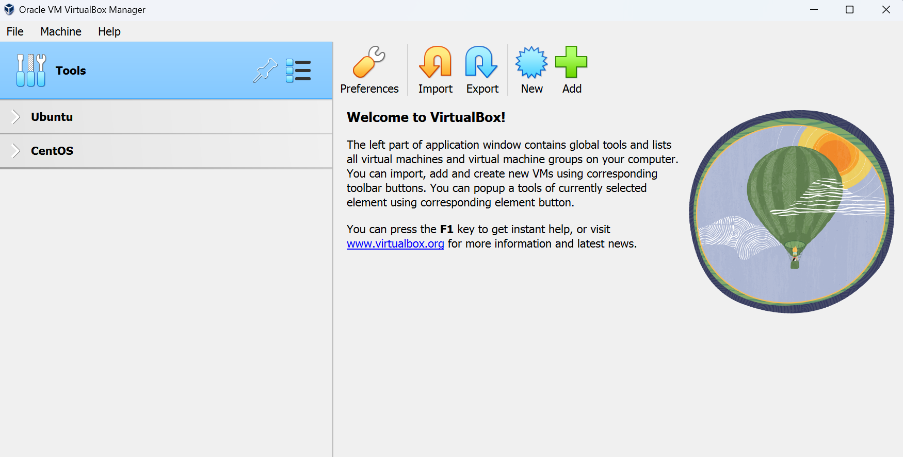

Select File from the top toolbar then choose `Import Appliance...` from the drop-down list or press `Ctrl+I`. The following window appears which allows you to specify the file where to import the virtual appliance from. Here you need to select the path of the virtual appliance. The virtual appliance has the extension `.ova`.

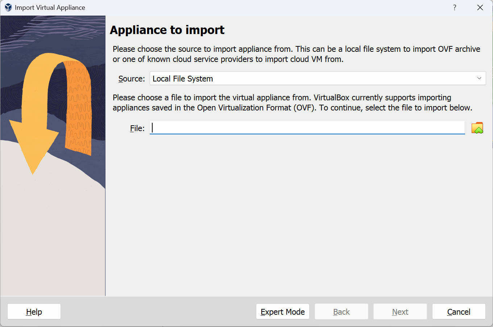

As shown in the figure below, select the path of the file `.ovf`then press Next.

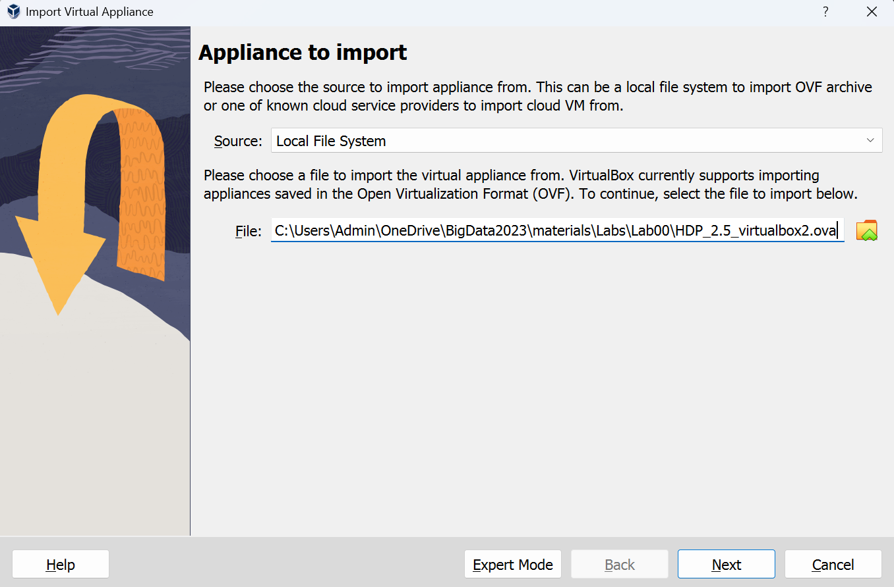

In the next window, you may need to change some settings. Make sure that you set the CPU cores to 4 and the RAM size to 8192 MB.

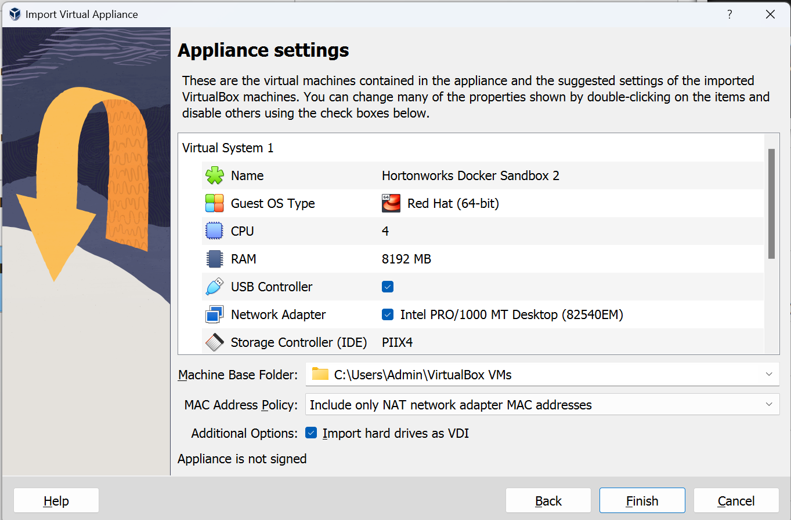

And wait for the appliance to be imported as shown in the figure below.

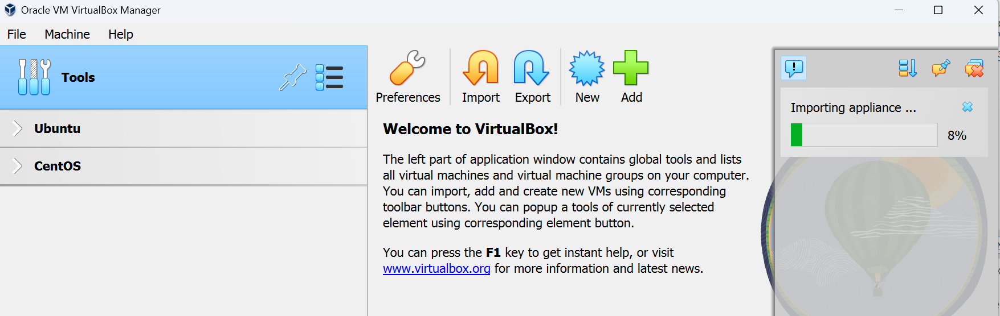

If you got a value 0 for the Base Memory after importing the appliance (a bug in VirtualBox), please update the value as explained above and start the virtual machine.

## Running the VM

The first boot of HDP Sandbox takes a lot of time, please take a break and wait till it finishes. Actually, during this time, the virtual machine is building the Docker image and then it starts to run a container for your cluster where you can access it from the host machine.
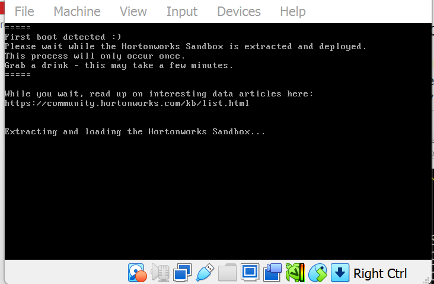

After finishing the extraction process, the system will run as shown below.

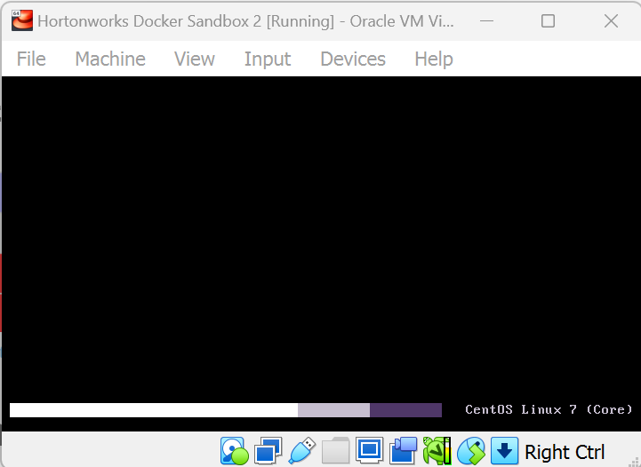


After the boot operation is done, you will see the following screen where it gives the address to access the splash webpage of the platform at http://locallhost:1080 or http://127.0.0.1:1080 for HDP 2.6.5.

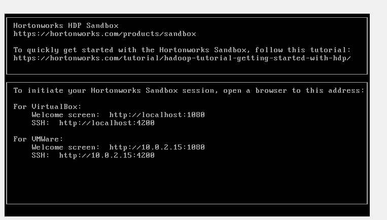

Now, you have finished installation and are ready to access the cluster.


## Access HDP Sandbox cluster

The installed HDP Sandbox cluster is a single node implementation of HDP. It is packaged as a virtual machine to make evaluation and experimentation with HDP fast and easy. You can access the splash webpage of the cluster via http://localhost:1080 for HDP 2.6.5

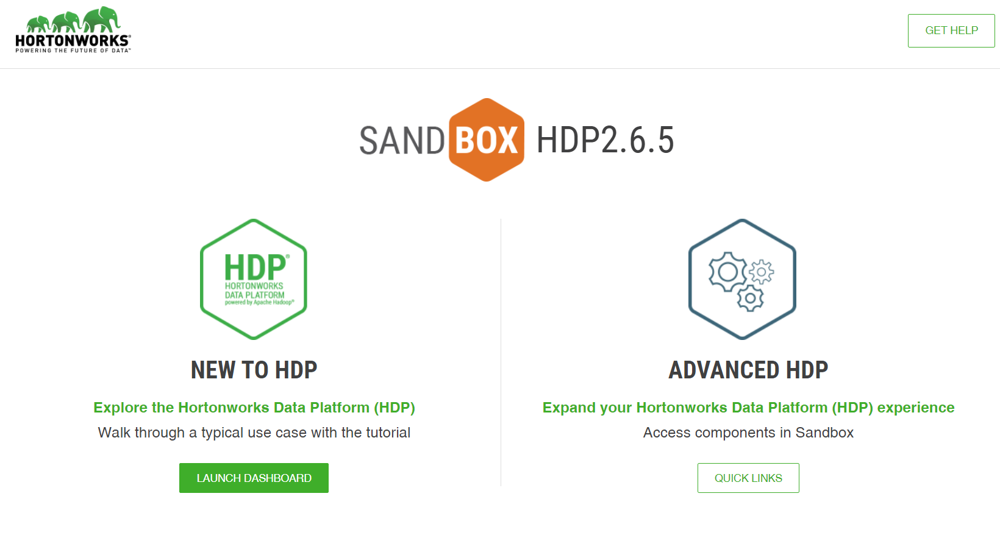

The button Quick Links will transfer you to the page of links where you can access some services of the cluster.

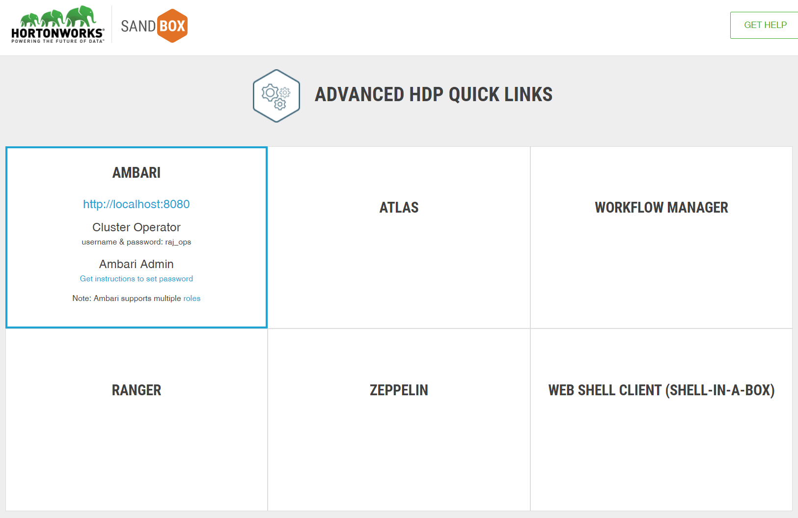

In order to see all services of the cluster, you need to access Ambari service at http://localhost:8080 where you can monitor and manage all services.

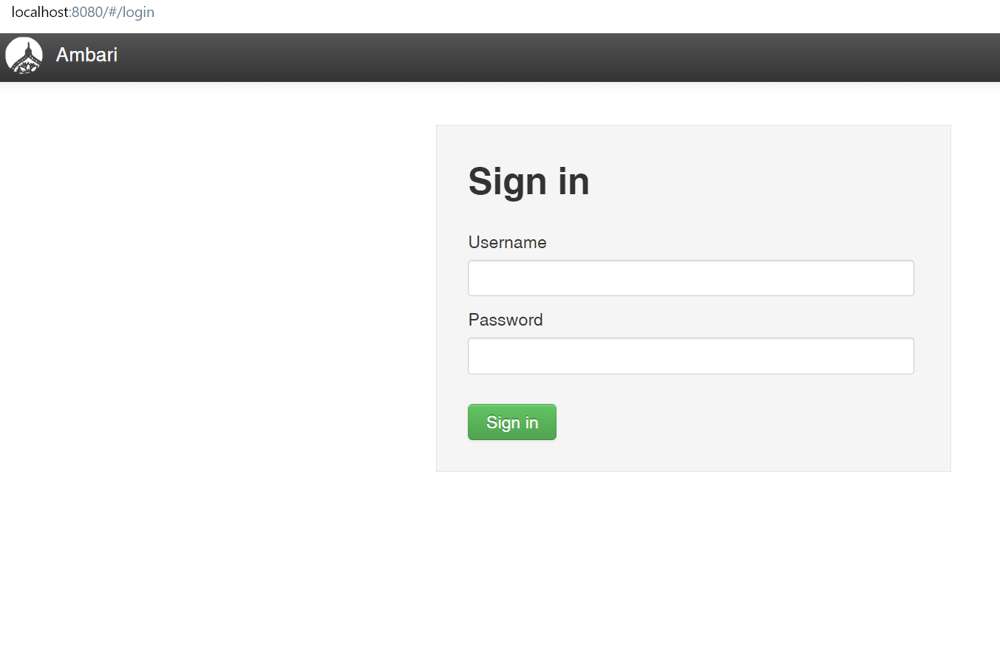

You need to log in in order to access this service. You can use the credentials of the user maria_dev/maria_dev as (username/passowrd). HDP Sandbox comes with 4 default users with different roles in the cluster and there is also Ambari Admin who can manage the other users in the cluster.

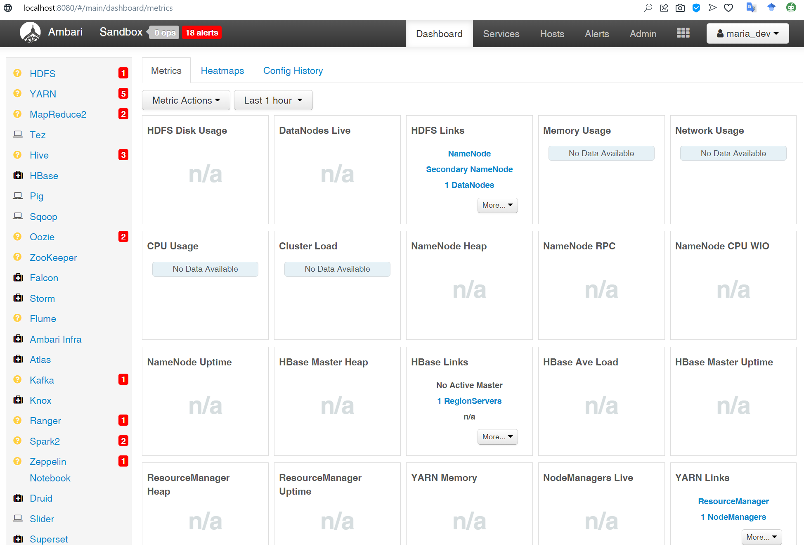

As you can see in Ambari homepage, most services are showing alerts since they did not start so far or due to some problems. You need to wait till services start then you can access them. If you have set less resources than required then it is probably that most services cannot be run, so you can stop the services which are not needed to let the required services run.

Once all services are up and running (take 15-20 minutes), the dash will become as in the following. 

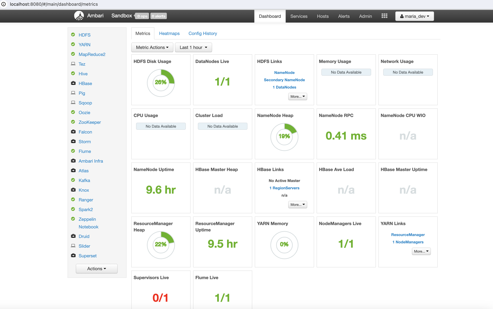


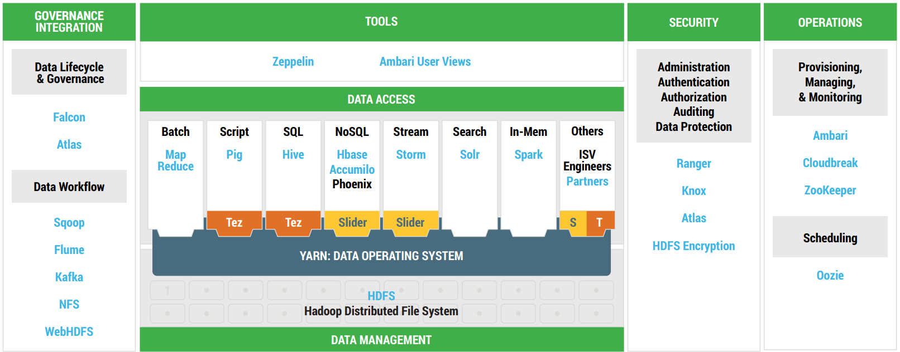


### Access HDFS
You can access HDFS files by selecting Files view in Ambari homepage.

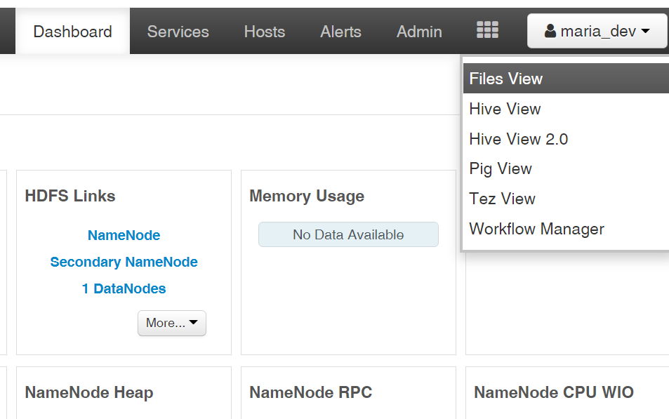

You can see in the following screen the contents of HDFS on the cluster. The page allows you to upload and download files/folders from/to local file system and HDFS.

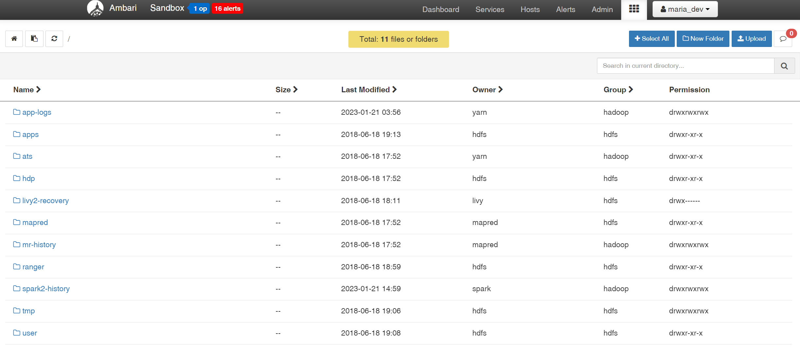


You can also access HDFS via CLI using the command hdfs dfs. For example, to list the content of the root directory / in HDFS, you can write as follows:
```
[root@sandbox-hdp ~]# hdfs dfs -ls /
```


## EXERCISE: 

1. Download dataset `movielens` and upload the data to HDFS of the HDP Sandbox.
   - Download link: http://media.sundog-soft.com/es/ml-100k.zip
   - **What is this dataset about? **
2. **APACHE PIG:**
   In Ambari dash, switch to Pig View, and execute this Pig script: 

```
ratings = LOAD '/user/maria_dev/ml-100k/u.data' AS (userID:int, movieID:int, rating:int, ratingTime:int);
metadata = LOAD '/user/maria_dev/ml-100k/u.item' USING PigStorage('|')
	AS (movieID:int, movieTitle:chararray, releaseDate:chararray, videoRealese:chararray, imdblink:chararray);
   
nameLookup = FOREACH metadata GENERATE movieID, movieTitle,
	ToUnixTime(ToDate(releaseDate, 'dd-MMM-yyyy')) AS releaseTime;
   
ratingsByMovie = GROUP ratings BY movieID;
avgRatings = FOREACH ratingsByMovie GENERATE group as movieID, AVG(ratings.rating) as avgRating;
fiveStarMovies = FILTER avgRatings BY avgRating > 4.0;
fiveStarsWithData = JOIN fiveStarMovies BY movieID, nameLookup BY movieID;
oldestFiveStarMovies = ORDER fiveStarsWithData BY nameLookup::releaseTime;
DUMP oldestFiveStarMovies;
```

- What does this give you? 
- What is it used for? 
- Explain each line in the script with your understanding.
- Use Pig Latin to answer the following question: 
  - Find all movies with an average rating less than 2.0 
  - Sort them by the total number of ratings (using `COUNT(<table>.<column>`) to count the number of a specific column.)


1. **APACHE HIVE** 