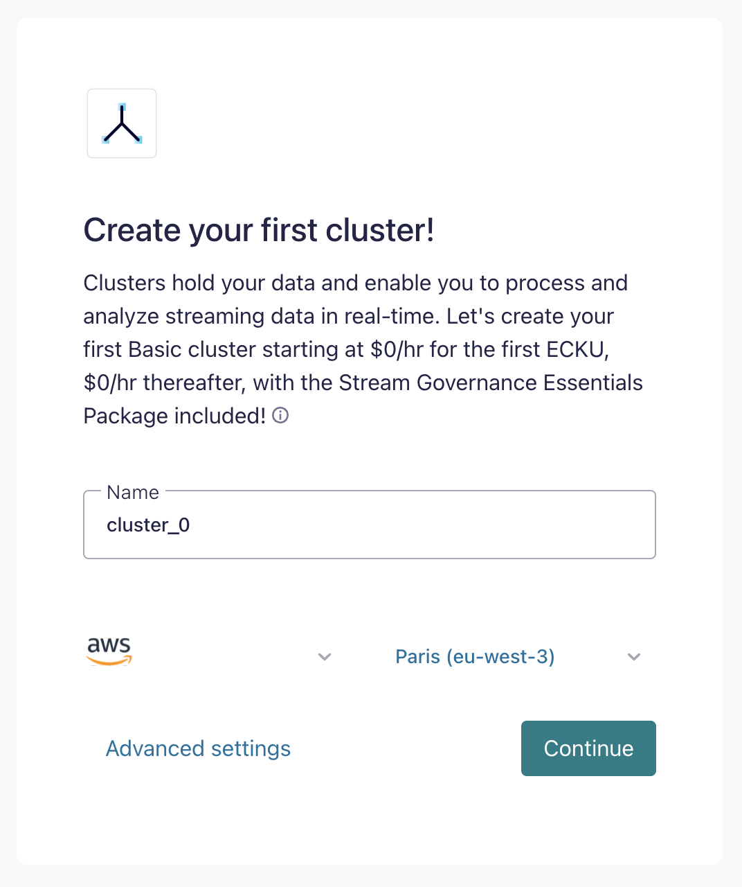
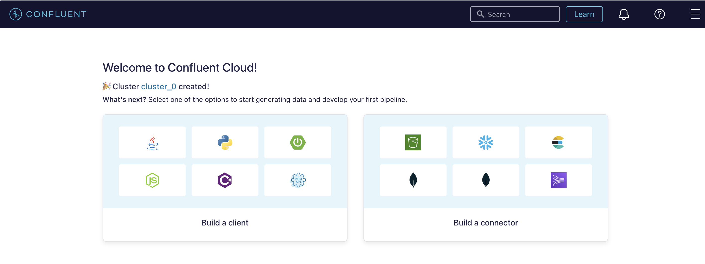
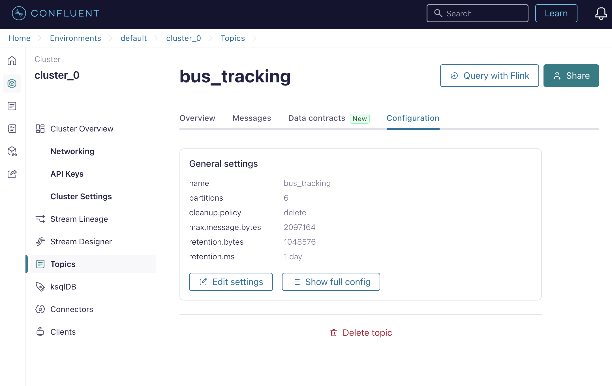
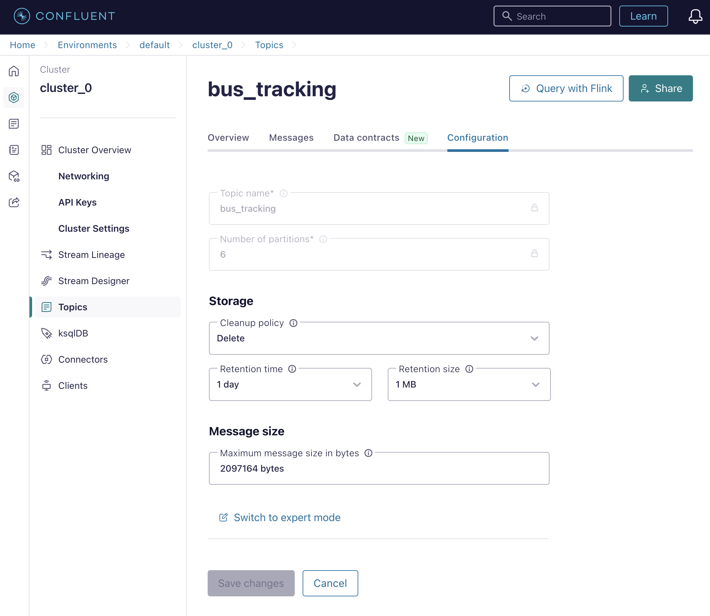
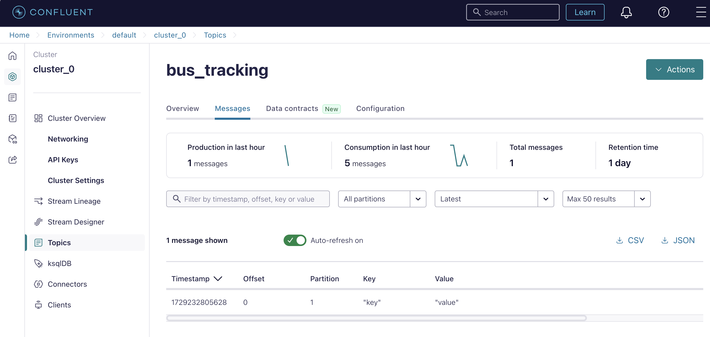

# LAB Session 2: Set up our Kafka cluster on the cloud 
### Disclaimer: 

__As part of your Confluent Cloud trial, you are provided with 400\$ in credits for use during the 30-day trial period.__ 
__Please note that it is your responsibility to manage your account and monitor your usage. Any additional charges incurred beyond the 400\$ credit or after the trial period ends will be your sole responsibility. Be sure to track your credit usage and the trial period's expiration to avoid any unexpected costs.__

__Please keep your eyes on [Billing & Payment](#monitoring-billing-and-payment) section to keep track of the credit and the spends__

## Sign-up for Confluent Cloud

- Start here at Confluent.io: https://www.confluent.io/get-started/

- Choose you deployment: `CLOUD`
- Sign up by filling in form with your: 
  + Full Name
  + Company
  + Email 
- Click on `Start Free`

💡 Keep in mind the [Disclaimer](#disclaimer) of the trial period. 

## Getting started 
### 💻 Configuring your cluster

- Choose the type of cluster as follow: 

<!--  -->
<br>

- Enter your payment info. _Please consider the [Disclaimer](#disclaimer) of the trial period_. 



- Now we will configure the client (producer/consumer) for the cluster to send/receive message.

### 🖥️ Configuring your client
#### 1. Create an API Key:
- Create an API key. This will include: 
  - API key
  - Secret
- Save the key somewhere for safety.
- You will need that for later use.

#### 2. Create your topic
You can follow the tutorial of Confluent page, where you can copy the code with the variables already filled. Otherwise, you can take a look hereunder.

Using the following command in your `Terminal`, and replace the following placeholders:
- `<name_of_topic_to_replace>`: replace with your topic name
- `<your-server-address>`: in your cluster details
- `<base64-encoded-API-key-and-secret>`: base64-encoded API key and secret in the following format `<key>:<secret>`
```
curl \
  -X POST \
  -H "Content-Type: application/json" \
  -H "Authorization: Basic <base64-encoded-API-key-and-secret>" \
  https://<your-server-address>:443/kafka/v3/clusters/lkc-npk70k/topics \
  -d '{"topic_name":"<name_of_topic_to_replace>"}'
```

Once this command is run successfully, your new topic will be displayed in the Confluent console (not in the tutorial page).

##### 2.1 Topic setting: 
To minimize the cost, we will set the following parameters for the topic: 
- `Retention time` : 1 day
- `Rentention size` : 1MB






You can also copy the details for configuration on client-side for later use: 

```
# Required connection configs for Kafka producer, consumer, and admin
bootstrap.servers=<your-server-address>:9092
security.protocol=SASL_SSL
sasl.mechanisms=PLAIN
sasl.username={{ CLUSTER_API_KEY }}
sasl.password={{ CLUSTER_API_SECRET }}

# Best practice for higher availability in librdkafka clients prior to 1.7
session.timeout.ms=45000

```

Now your client is almost set. We will move to the code and LAB part, in which you will need to create a Producer and a Consumer to send and receive the message.

---

## LAB SESSION

### 0. Prerequisite
#### > 0.1. Create a config file named `client.properties` in your working directory with the following content: 

```
# Required connection configs for Kafka producer, consumer, and admin
bootstrap.servers=<your-server>:9092
security.protocol=SASL_SSL
sasl.mechanisms=PLAIN
sasl.username=<your-API-key>
sasl.password=<your-API-secret>

# Best practice for higher availability in librdkafka clients prior to 1.7
session.timeout.ms=45000

```

#### > 0.2 Prepare Python environment: 

  - Download and install Miniconda at https://www.anaconda.com/download/success
  - Once installed, create your virtual environment with `conda`

```
# Create virtual environment named kafka-<yourname>
conda create -n kafka-<yourname> python=3.11

# Turn this environment on, you will see in your terminal, the (base)
#environment now becomes kafka-<yourname>
conda activate kafka-<yourname>

# Install the kafka-python package
pip install confluent-kafka
```

### 1. Kafka Producer

- Create your first Kafka producer.

The Kafka Producer can be created using the template in `TD2/samples/producer.py`.
Run the producer and take a look at your Confluent console, you'll see the first message popping up! 



| _Question 1_ |
|------------|
| Fill in this chunk of code so that we can send to Kafka cluster a data about the position of the bus, with the following information: <ul><li>`bus_id`</li><li>`longitude`</li><li>`latitude`</li></ul> <br> The data sent to cluster must in JSON format.|

Once you’ve done this right, you can find in the Confluent UI your first sucessfully sent message.


| _Question 2_ |
|------------|
| <ul><li>Develop from the __Question 1__, modify the Kafka Producer so that it can produce at least 10 different messages with a fixed interval (for example: once every second).</li><li>Stop the producer when we surpass 100 messages (to avoid the cost on Confluent).</li></ul>|

<br> 

| _Question 3_ |
|------------|
|<ul><li>Propose a use case of data stream.</li><li>Create a topic corresponding to your use case.</li><li>Write a data stream with appropriate data structure for the aformentioned topic.</li>|

### 2. Kafka Consumer

The Kafka Consumer can be created using the template in `TD2/samples/consumer.py`. The Consumer plays the role as its name, in which it will "consume" the messages from the topic Kafka once the message arrives to the topic.

| _Question 4_ |
|------------|
|<ul><li>Subscribe to the topic using `subscribe` function of `Consumer` class </li><li>Once having subscribed to the topic, get new records by using `poll` function</li> <li>Set poll timeout parameter to be 1 second.</li><li>Run the consumer to get the message and print it to the console.</li></ul>|


---

## 💰 Monitoring Billing and Payment
Your Billing and Payment section: https://confluent.cloud/settings/billing/invoice