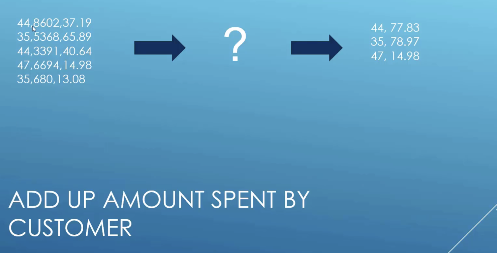
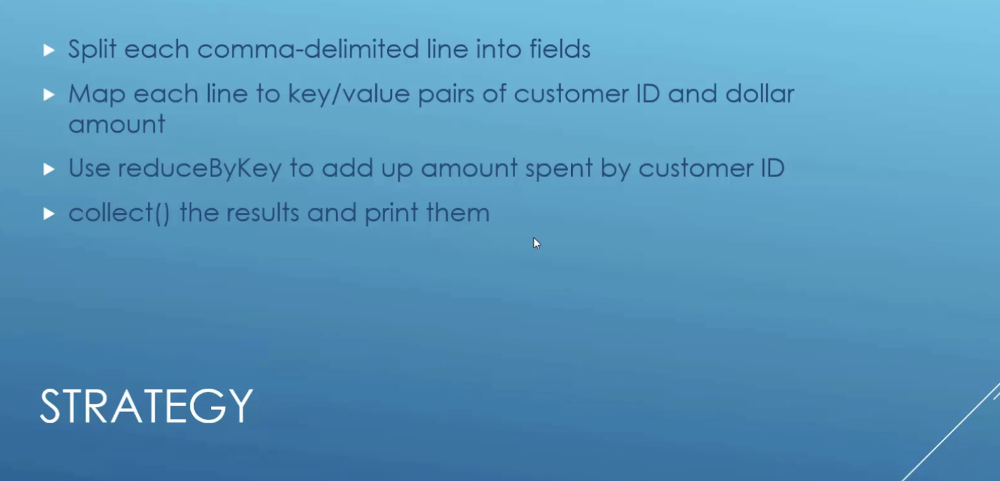
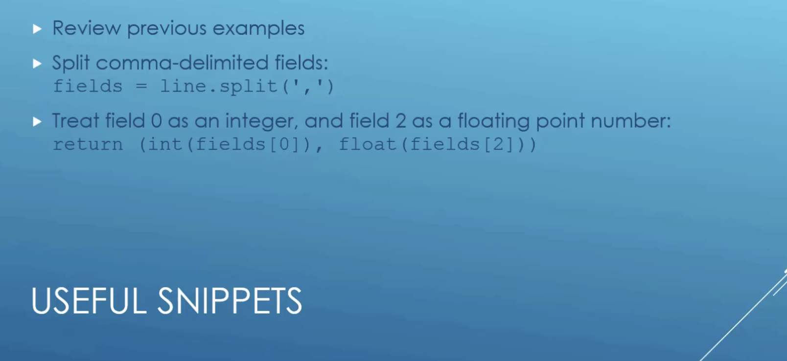
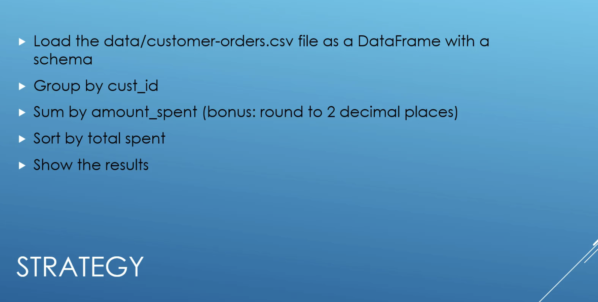
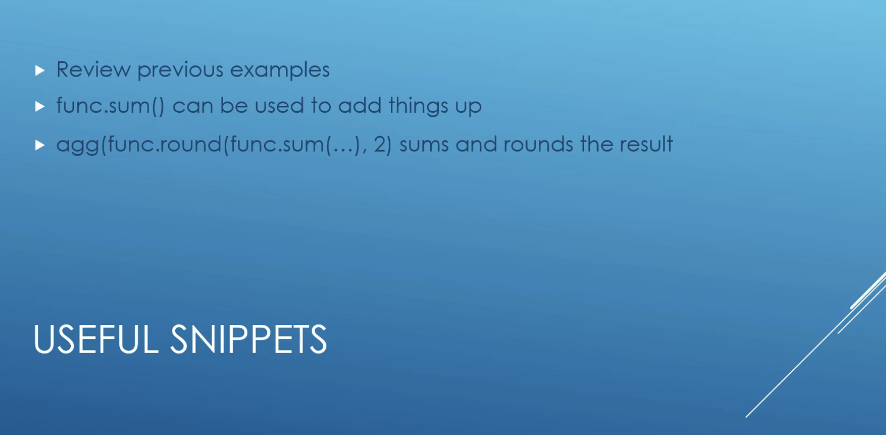

# TD3 : Apache Hive & Apache Spark

## Submission: 
- Put your code snippet and explain it in a PDF file.
- Zip your code snippet + PDF and submit as a whole. 

## References: 
- Spark RDD Programming Guide: https://spark.apache.org/docs/latest/rdd-programming-guide.html 
- Spark SQL Programming Guide: https://spark.apache.org/docs/latest/sql-programming-guide.html
- API Reference: https://spark.apache.org/docs/latest/api/python/reference/pyspark.sql/index.html
- PySpark: https://spark.apache.org/docs/latest/api/python/index.html


## Part 1: Apache Hive
Take a look back at TD2 to get familiar with HDP platform interface. 

In Ambari dash, switch to Hive View, and do the following: 

#### Q1 -  Upload data file: Go to `Upload Table`, upload `u.data` to Hive as `ratings` table.
    - Which is the separator of this file?  
#### Q2 - Upload data file: upload `u.item` to Hive as `names` table. 
    - Which is the separator of this file? How do you handle it using the Interface? 
    - What is the equivalent HiveQL to load this file `u.item`?

#### Q3 - In the `Query` tab, do the following actions and put in the report the script for: 
    - Create a view named `topMovieIDs` from `ratings` and `names`.
    - Show the name of topMovieIDs 
    
#### Q4 - Using the AVG() function for aggregating data: 
    - Find the movie with highest average rating
    - [Bonus] Only consider movies with at least 10 ratings.


## Part 2: Apache Spark

### Exercise 1: Find the total spend by customer, using RDD

- Requirements: Read the file `customer-orders.csv`, then find the total spend by customer, using RDD.








### Exercise 2: Find the total spend by customer, using Spark DataFrame

- Requirements: Read the file `customer-orders.csv`, then find the total spend by customer, using SparkSQL with Spark DataFrame.







### Exercise 3: Number of friends per age: 

- Data: Using `fakefriends_header.csv`, do the following analysis: 
- Requirements: 
    - Number of friends per age
    - Who has the most number of friends ?
    - Regroup ages to age group of 5, and name this new column `age_group`. For example: [0-5], [6-10], [11-15], ..., [60-65],...
        - Number of friends per `age_group`. 


### Exercise 4: Tweets analysis: 

- Data: Download the following dataset: https://www.gakhov.com/datasets/stratahadoop-barcelona-2014-tweets.html 
- Samples for extracting data using Scala with RDD: 
    - Read the file in Spark, and get a DataFrame
        ```scala
        val df = sqlContext.read.json("filename")
        ``` 
    - Get an RDD with the text of the tweets
        ```scala 
        val rdd = df.select("text").rdd.map(row =>
        row.getString(0))
        ```
    - Count words
        ```scala 
        val wordCounts = rdd.flatMap( .split(" ")).map(word =>
        (word,1)).reduceByKey((a,b) => a+b)
        ```
    - Show 10 word counts
        ```scala
        wordCounts.take(10).foreach(println)
        ```

#### --- Requirements: 
- Write a report on the following tasks, writing the code in Scala/Python and using Apache Spark:
    - Find hashtags on tweets
    - Count hashtags on tweets
    - Select the 10 most frequent hashtags
    - Select the 10 users with the most tweets
    - [Bonus] Detect trending topics

- [Bonus] Write program in Scala.