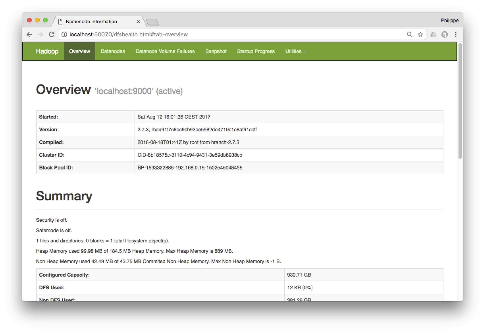

#TUTORIAL HADOOP
## Hadoop
### Installation et configuration
Je vous invite donc à récupérer la dernière version (binaire, inutile de prendre les sources) sur le site http://hadoop.apache.org. 

__** Remplace par la version plus récente: 3.3.6__ 

C’est un fichier dont le nom ressemble à hadoop-3.3.6.tar.gz. Décompressez-le quelque part, par exemple dans \tmp. les commandes devraient ressembler à (en utilisant bien sûr le nom du fichier récupéré):
```
mv hadoop-3.3.6.tar.gz /tmp
cd /tmp
tar xvfz hadoop-3.3.6.tar.gz
```
Bien, vous devez alors définir une variable d’environnement HADOOP_HOME qui indique le répertoire d’installation de Hadoop.

```
export HADOOP_HOME=/tmp/hadoop-3.3.6
```
Les répertoires bin et sbin de Hadoop contiennent des exécutables. Pour les lancer sans avoir à se placer dans l’un de ces répertoires, ajoutez-les dans votre variable PATH.

```
export PATH=$PATH:$HADOOP_HOME/bin:$HADOOP_HOME/sbin
```
Bien, vous devriez alors pouvoir exécuter un programme Hadoop. Par exemple:
```
hadoop version
Hadoop 3.3.6
```

Pour commencer il faut configurer Hadoop pour qu’il s’exécute en mode dit « pseudo-distribué », ce qui évite la configuration complexe d’un véritable cluster. 
Vous devez éditer le fichier $HADOOP_HOME/etc/hadoop/core-site.xml et indiquer le contenu suivant :

```
<configuration>
  <property>
    <name>fs.default.name</name>
    <value>hdfs://localhost:9000</value>
  </property>
 </configuration>
 ```
Cela indique à Hadoop que le nœud maître HDFS (le « NameNode » dans la terminologie Hadoop) est en écoute sur le port 9000.

Pour limiter la réplication, modifiez également le fichier $HADOOP_HOME/etc/hadoop/hdfs-site.xml. Son contenu doit être le suivant:
```
<configuration>
    <property>
        <name>dfs.replication</name>
        <value>1</value>
    </property>
</configuration>
```
### Premières manipulations

Ouf, la configuration minimale est faite, nous sommes prêts à effectuer nos premières manipulations. Tout d’abord nous allons formatter l’espace dédié au stockage des données.

```
hdfs namenode -format
```

Une fois ce répertoire formatté nous lançons le maître HDFS (le namenode). Ce maître gère la hiérarchie (virtuelle) des répertoires HDFS, et communique avec les datanodes, les « esclaves » dans la terminologie employée jusqu’ici, qui sont chargés de gérer les fichiers (ou fragments de fichiers) sur leurs serveurs respectifs. Dans notre cas, la configuration ci-dessus va lancer un namenode et deux datanodes, grâce à la commande suivante:

```
start-dfs.sh &
```
Note

Les nœuds communiquent entre eux par SSH, et il faut éviter que le mot de passe soit demandé à chaque fois. Voici les commandes pour permettre une connection SSH sans mot de passe.

```
ssh-keygen -t rsa -P ""
cat $HOME/.ssh/id_rsa.pub >> $HOME/.ssh/authorized_keys
```
Vous devriez obtenir les messages suivants:

```
starting namenode, logging to (...)
localhost: starting datanode, logging to (...)
localhost: starting secondarynamenode, logging to (...)
```

Le second namenode est un miroir du premier. À ce stade, vous disposez d’un serveur HDFS en ordre de marche. Vous pouvez consulter son statut et toutes sortes d’informations grâce au serveur web accessible à http://localhost:50070. 
La figure montre l’interface




Bien entendu, ce système de fichier est vide. Vous pouvez y charger un premier fichier, à récupérer sur le site à l’adresse suivante `author-medium`. Il s’agit d’une liste de publications sur laquelle nous allons faire tourner nos exemples.

Pour interagir avec le serveur de fichier HDFS, on utilise la commande hadoop fs <commande> où commande est la commande à effectuer. La commande suivante crée un répertoire /dblp dans HDFS.

```
hadoop fs -mkdir /dblp
```
Puis on copie le fichier du système de fichiers local vers HDFS.
```
hadoop fs -put author-medium.txt /dblp/author-medium.txt
```
Finalement, on peut constater qu’il est bien là.
```
hadoop fs -ls /dblp
```

__Note__

Vous trouverez facilement sur le web des commandes supplémentaires, par exemple ici: https://dzone.com/articles/top-10-hadoop-shell-commands

Pour inspecter le système de fichiers avec l’interface Web, vous pouvez aussi accéder à http://localhost:50070/explorer.html#/


Que sommes-nous en train de faire? Nous copions un fichier depuis notre machine locale vers un système distribué sur plusieurs serveurs. Si le fichier est assez gros, il est découpé en fragments et réparti sur différents serveurs. Le découpage et la recomposition sont transparents et entièrement gérés par Hadoop.

Nous avons donc réparti nos données (si du moins elles avaient une taille respectable) dans le cluster HDFS. Nous sommes donc en mesure maintenant d’effectuer un calcul réparti avec MapReduce.

## MapReduce, le calcul distribué avec Hadoop
L’exemple que nous allons maintenant étudier est un processus MapReduce qui accède au fichier HDFS et effectue un calcul assez trivial. Ce sera à vous d’aller plus loin ensuite.

### Installation et configuration
Depuis la version 2 de Hadoop, les traitements sont gérés par un gestionnaire de ressources distribuées nommé Yarn. Il fonctionne en mode maître/esclaves, le maître étant nommé Resourcemanager et les esclaves NodeManager.

Un peu de configuration préalable s’impose avant de lancer notre cluster Yarn. Editez tout d’abord le fichier $HADOOP_HOME/etc/hadoop/mapred-site.xml avec le contenu suivant:

```
<configuration>
    <property>
       <name>mapreduce.framework.name</name>
       <value>yarn</value>
    </property>
</configuration>
```
Ainsi que le fichier $HADOOP_HOME/etc/hadoop/yarn-site.xml:
```
<configuration>
    <property>
       <name>yarn.nodemanager.aux-services</name>
       <value>mapreduce_shuffle</value>
    </property>
 </configuration>
 ```
Vous pouvez alors lancer un cluster Yarn (en plus du cluster HDFS).

```
start-yarn.sh
```
Yarn propose une interface Web à l’adresse http://localhost:8088/cluster: Elle montre les applications en cours ou déjà exécutées.

### Notre programme MapReduce

__Important__

Toutes nos compilations java font se fait par l’intermédiaire du script hadoop. Il suffit de définir la variable suivante au préalable:
```
export HADOOP_CLASSPATH=${JAVA_HOME}/lib/tools.jar
```
Le format du fichier que nous avons placé dans HDFS est très simple: il contient des noms d’auteur et des titres de publications, séparés par des tabulations. Nous allons compter le nombre de publications de chaque auteur dans notre fichier.

Notre première classe Java contient le code de la fonction de Map.
```
/**
 * Les imports indispensables
 */

import java.io.IOException;
import java.util.Scanner;
import org.apache.hadoop.io.IntWritable;
import org.apache.hadoop.io.Text;
import org.apache.hadoop.mapreduce.Mapper;

/**
 * Exemple d'une fonction de map: on prend un fichier texte contenant
 * des auteurs et on extrait le nom
 */
public class AuthorsMapper extends
  Mapper<Object, Text, Text, IntWritable> {

  private final static IntWritable one = new IntWritable(1);
  private Text author = new Text();

   /* la fonction de Map */
    @Override
    public void map(Object key, Text value, Context context)
       throws IOException, InterruptedException {

      /* Utilitaire java pour scanner une ligne  */
      Scanner line = new Scanner(value.toString());
      line.useDelimiter("\t");
      author.set(line.next());
      context.write(author, one);
    }
  }

```
Hadoop fournit deux classes abstraites pour implanter des fonctions de Map et de Reduce: Mapper et Reducer. Il faut étendre ces classes et implanter deux méthodes, respectivement map() et reduce().

L’exemple ci-dessus montre l’implantation de la fonction de map. Les paramètres de la classe abstraite décrivent respectivement les types des paires clé/valeur en entrée et en sortie. Ces types sont fournis pas Hadoop qui doit savoir les sérialiser pendant les calculs pour les placer sur disque. Finalement, la classe Context est utilise pour pouvoir interagir avec l’environnement d’exécution.

Notre fonction de Map prend donc en entrée une paire clé/valeur constituée du numéro de ligne du fichier en entrée (automatiquement engendrée par le système) et de la ligne elle-même. Notre code se contente d’extraire la partie de la ligne qui précède la première tabulation, en considérant que c’est le nom de l’auteur. On produit dont une paire intermédiaire (auteur, 1).

La fonction de Reduce est encore plus simple. On obtient en entrée le nom de l’auteur et une liste de 1, aussi longue qu’on a trouvé d’auteurs dans les fichiers traités. On fait la somme de ces 1.

import java.io.IOException;
import org.apache.hadoop.io.IntWritable;
import org.apache.hadoop.io.Text;
import org.apache.hadoop.mapreduce.Reducer;
```
/**
 * La fonction de Reduce: obtient des paires  (auteur, <publications>)
 * et effectue le compte des publications
 */
public  class AuthorsReducer extends
      Reducer<Text, IntWritable, Text, IntWritable> {
   private IntWritable result = new IntWritable();

   @Override
   public void reduce(Text key, Iterable<IntWritable> values,
        Context context)
    throws IOException, InterruptedException {

    int count = 0;
    for (IntWritable val : values) {
      count += val.get();
    }
    result.set(count);
    context.write(key, result);
  }
}
```
Nous pouvons maintenant soumettre un « job » avec le code qui suit. Les commentaires indiquent les principales phases. Notez qu’on lui indique les classes implantant les fonctions de Map et de Reduce, définies auparavant.
```
  /**
   * Programme de soumision d'un traitement MapReduce
   */

  import org.apache.hadoop.conf.*;
  import org.apache.hadoop.util.*;
  import org.apache.hadoop.fs.Path;
  import org.apache.hadoop.io.IntWritable;
  import org.apache.hadoop.io.Text;
  import org.apache.hadoop.mapreduce.Job;
  import org.apache.hadoop.mapreduce.lib.input.FileInputFormat;
  import org.apache.hadoop.mapreduce.lib.output.FileOutputFormat;

  public class AuthorsJob {

  public static void main(String[] args) throws Exception {

   /* Il nous faut le chemin d'acces au fichier a traiter
           et le chemin d'acces au resultat du reduce */

    if (args.length != 2) {
      System.err.println("Usage: AuthorsJob <in> <out>");
      System.exit(2);
    }

   /* Definition du job */
   Job job = Job.getInstance(new Configuration());

   /* Definition du Mapper et du Reducer */
   job.setMapperClass(AuthorsMapper.class);
   job.setReducerClass(AuthorsReducer.class);

   /* Definition du type du resultat  */
   job.setOutputKeyClass(Text.class);
   job.setOutputValueClass(IntWritable.class);

   /* On indique l'entree et la sortie */
   FileInputFormat.addInputPath(job, new Path(args[0]));
   FileOutputFormat.setOutputPath(job, new Path(args[1]));

   /* Soumission */
   job.setJarByClass(AuthorsJob.class);
   job.submit();
  }
}
```


Un des rôles importants du Job est de définir la source en entrée pour les données (ici un fichier HDFS) et le répertoire HDFS en sortie, dans lequel les reducers vont écrire le résultat.

Compilation, exécution
Il reste à compiler et à exécuter ce traitement. La commande de compilation est la suivante.

```
hadoop com.sun.tools.javac.Main AuthorsMapper.java AuthorsReducer.java AuthorsJob.java
```
Les fichiers compilés doivent ensuite être placés dans une archive java (jar) qui sera transmise à tous les serveurs avant l’exécution distribuée. Ici, on crée une archive authors.jar.

```
jar cf authors.jar AuthorsMapper.class AuthorsReducer.class AuthorsJob.class
```
Et maintenant, on soumet le traitement au cluster Yarn avec la commande suivante:

```
hadoop jar authors.jar AuthorsJob /dblp/author-medium.txt /output
```
On indique donc sur la ligne de commande le Job à exécuter, le fichier en entrée et le répertoire des fichiers de résultat. Dans notre cas, il y aura un seul reducer, et donc un seul fichier nommé part-r-00000 qui sera donc placé dans /output dans HDFS.

__Important__

Le répertoire de sortie ne doit pas exister avant l’exécution. Pensez à le supprimer si vous exécutez le même job plusieurs fois de suite.

```
hadoop fs -rm -R /output
```
Une fois le job exécuté, on peut copier ce fichier de HDFS vers la machine locale avec la commande:
```
hadoop fs -copyToLocal /output/part-r-00000 resultat
```
Et voilà! Vous avez une idée complète de l’exécution d’un traitement MapReduce. Le résultat devrait ressembler à:
```
(...)
Dominique Decouchant    1
E. C. Chow      1
E. Harold Williams      1
Edward Omiecinski       1
Eric N. Hanson  1
Eugene J. Shekita       1
Gail E. Kaiser  1
Guido Moerkotte 1
Hanan Samet     2
Hector Garcia-Molina    2
Injun Choi      1
(...)
```
Notez que les auteurs sont triés par ordre alphanumérique, ce qui est un effet indirect de la phase de shuffle qui réorganise toutes les paires intermédiaires.

En inspectant l’interface http://localhost:8088/cluster vous verrez les statistiques sur les jobs exécutés.
